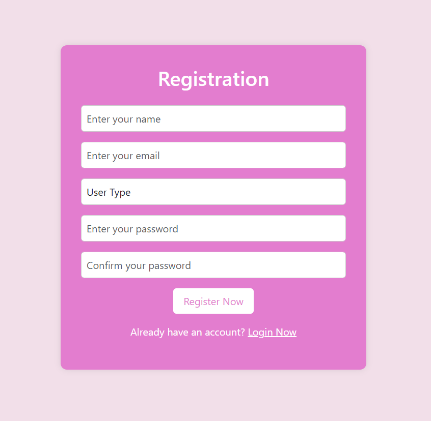

 # Login Registration System

## Description
This is a PHP-based login and registration system.

## Features
- User Login
- User Registration
- Admin Panel

## Technologies Used
- PHP
- MySQL
- HTML
- CSS

## How to Run
1. Start XAMPP
2. Move project to htdocs
3. Run localhost/registration

## 📷 Screenshots

